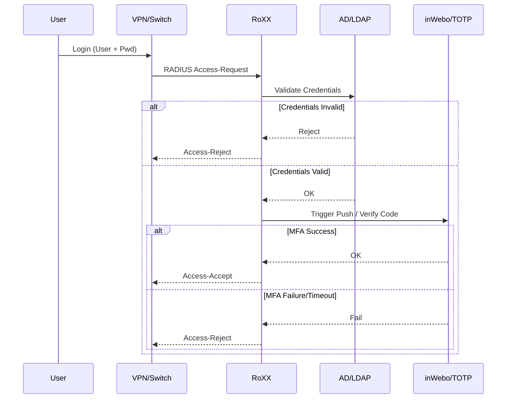
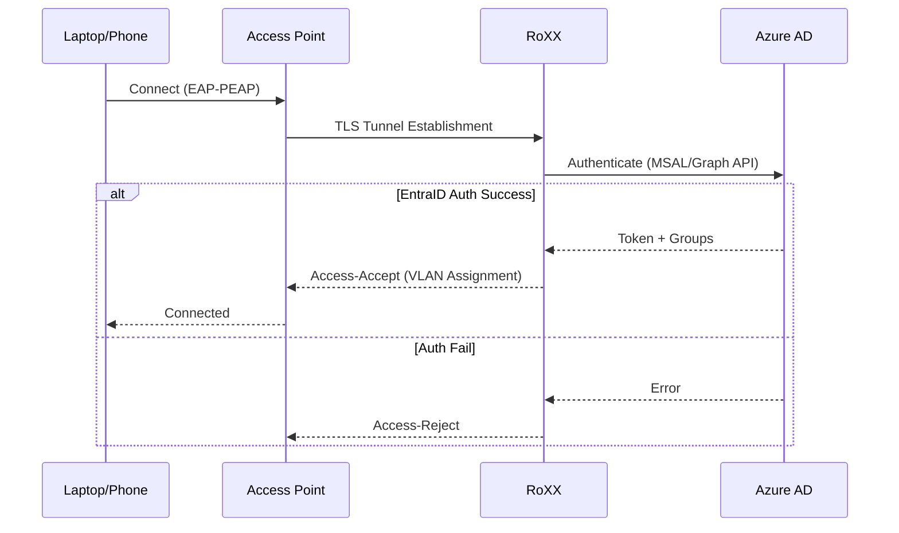
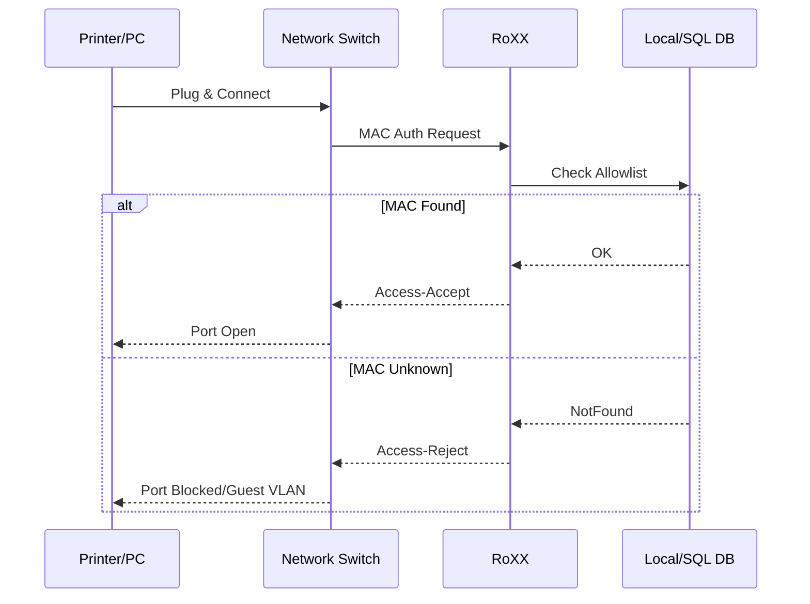

# RoXX


**R**adius **O**pen e**X**tensible e**X**change - Version 1.0.0-beta2

Modern Python-based RADIUS proxy for Linux with advanced authentication backends.

---

## ✨ Features

- **Linux Native**: Optimized for Debian/RedHat based systems
- **Modern TUI Console**: Rich terminal interface for administration
- **Multiple Auth Backends**:
  - inWebo Push Authentication
  - TOTP (RFC 6238) - Google/Microsoft Authenticator
  - EntraID/Azure AD
  - Active Directory (LDAP/Kerberos)
  - Local Users Database
  - YubiKey OTP
- **FreeRADIUS Integration**: Seamless integration via exec modules
- **Web Interface**: Modern FastAPI-based admin panel
- **PKI Management**: Built-in Certificate Authority support
- **Comprehensive Testing**: 35+ unit tests included

---

## 🔀 Authentication Flows

### 1. Standard MFA Flow (VPN/SSH)
Classic scenario where **RoXX** validates the primary password against Active Directory/LDAP, then challenges the user for MFA (TOTP or inWebo Push).



### 2. Cloud Identity Flow (WiFi 802.1X)
Modern scenario where **RoXX** acts as a bridge between legacy EAP-PEAP WiFi infrastructure and cloud-native **EntraID** (Azure AD).



### 3. Wired Network Access (Switch / Port Security)
Physical access control where a switch authenticates a device (Printer, PC) via MAC Address or 802.1X before opening the port.



---

## 🚀 Quick Start

## 🐳 Docker Deployment

The easiest way to run RoXX is with Docker:

```bash
# Clone repository
git clone https://github.com/tsautier/RoXX.git
cd RoXX

# Start with Docker Compose
docker compose up -d

# Check logs
docker compose logs -f

# Access logs directly
docker exec -it roxx ls /var/log/roxx
```

## 🛠 Manual Installation

### Requirements
- Linux (Debian/Ubuntu/CentOS/RHEL)
- **Python 3.9+** (Required)
- **FreeRADIUS 3.0+** (Required for production, optional for unit tests)

- **Optional**: Active Directory, LDAP, EntraID for respective backends

```bash
# Clone repository
git clone https://github.com/tsautier/RoXX.git
cd RoXX

# Install dependencies
pip install -r requirements.txt

# Or install as package
pip install -e .
```

### Usage

```bash
# Launch admin console
roxx-console

# Run setup wizard
roxx-setup

# Start web interface
roxx-web

# Factory reset
roxx-reset
```

---

## 📊 Use Cases

### VPN Authentication
Secure VPN access with MFA using inWebo Push or TOTP

### WiFi 802.1X
Enterprise WiFi authentication with EntraID/Azure AD integration

### Network Access Control
Port-based authentication for switches with YubiKey support

---

## 🏗️ Architecture

```
roxx/
├── cli/          # Command-line interfaces
│   ├── console.py   # Admin console
│   ├── setup.py     # Setup wizard
│   └── reset.py     # Factory reset
├── core/         # Core functionality
│   ├── auth/        # Authentication modules
│   │   ├── inwebo.py   # inWebo Push
│   │   ├── totp.py     # TOTP
│   │   └── entraid.py  # EntraID
│   └── services.py  # Service management
├── utils/        # Utilities
│   ├── system.py    # System operations
│   └── i18n.py      # Internationalization
└── web/          # Web interface
    ├── app.py       # FastAPI application
    └── templates/   # HTML templates
```

---

## 🔧 Configuration

Configuration templates are provided in the `config/` directory:

- FreeRADIUS site, EAP, MS-CHAP, LDAP modules
- RADIUS clients configuration
- Authentication provider settings
- User databases

---

## 📚 Documentation

- [Quick Start Guide](QUICKSTART.md)
- [Testing Guide](TESTING_GUIDE.md)
- [FreeRADIUS Integration](FREERADIUS_INTEGRATION.md)

- [Build Instructions](BUILD.md)
- [Project Overview](PROJECT_OVERVIEW.md)
- [Changelog](CHANGELOG.md)

---

## 🧪 Testing

```bash
# Run all tests
pytest

# Run with coverage
pytest --cov=roxx --cov-report=html

# Test specific module
pytest tests/test_totp.py
```

---

## 📦 Building


```bash
pyinstaller roxx.spec
```

### Python Package
```bash
python -m build
```

See [BUILD.md](BUILD.md) for detailed instructions.

---

## 🌐 Web Interface

Access the modern web admin panel:

```bash
roxx-web
```

Then open http://localhost:8000

Features:
- TOTP QR code generation
- User management
- System monitoring
- Configuration management

---

## 🛡️ Security

- TLS 1.2+ only for EAP
- Secure cipher suites
- Certificate-based authentication
- Encrypted credential storage
- Comprehensive logging

---

## 📋 Requirements

- **Python 3.9+** (Required)
- **FreeRADIUS 3.0+** (Required for production, optional for unit tests)

- **Optional**: Active Directory, LDAP, EntraID for respective backends

---

## 🤝 Contributing

Contributions are welcome! Please feel free to submit pull requests.

---

## 📄 License

GNU General Public License v3.0 - See [LICENSE](LICENSE) file for details.

---

## 🆘 Support

For issues and questions, please use the GitHub issue tracker.

---

**RoXX** - Modern RADIUS Authentication for the Modern Era
